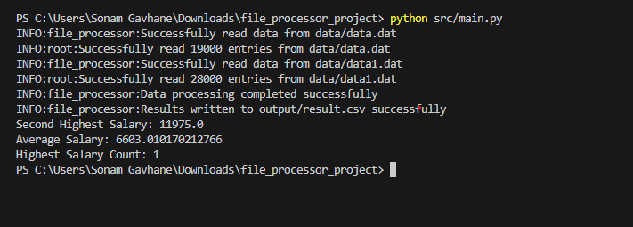

# File Processor

## Overview
The File Processor is a backend application designed to read data from multiple files located in a particular folder, process the data, and generate an output CSV file with specific requirements. The goal is to ensure accurate conversion of input data into the expected CSV format.


## Requirements
- Python 3.11

## Installation
1. Clone the repository to your local machine:

    ```
    git clone <repository-url>
    ```

2. Navigate to the project directory:

    ```
    cd file_processor
    ```

## Usage
1. Ensure that the input data files are located in the `data` directory.
2. Open a terminal and navigate to the project directory.
3. Run the main.py script:

    ```
    python main.py
    ```

4. The program will read data from the input files, process it, and generate an output CSV file in the `output` directory.
5. After execution, you can find the generated CSV file named `result.csv` in the `output` directory.

## Output
The output CSV file (`result.csv`) contains processed data along with additional footer information, including the second highest salary, average salary, highest salary, and highest salary count.

## Contributing
If you'd like to contribute to this project, please fork the repository and submit a pull request. You can also open an issue for any bugs or feature requests.

## License
This project is licensed under the [MIT License](LICENSE).

## Input Data
- The input data consists of multiple files located in a specified folder.
- Each file contains tab-separated data representing employee records, including fields such as ID, first name, last name, email, job title, basic salary, and allowances.
- Check the output folder for the generated `result.csv` file.

## Processing
- The application reads each input file and extracts the relevant information for processing.
- It calculates the second highest salary and the average salary from the salary data obtained from each file.
- Duplicate data is filtered out to ensure integrity in the output file.

## Output
- The processed data is written into an output CSV file with specific formatting.
- The output CSV file includes a footer section containing the details of the second highest salary and the average salary.
- The file is saved in a designated output folder (`output/RESULT.csv`).

## Design Considerations
- The application should be designed for scalability to handle large volumes of data efficiently.
- Error handling mechanisms should be implemented to manage exceptions during file processing.
- Modularity and code reusability are emphasized to facilitate future enhancements or modifications.

## Technology Stack
- Programming Language: Python
- Libraries/Frameworks: CSV, OS

## Testing
- Unit tests are conducted to validate the accuracy of data processing and output file generation.
- Integration tests ensure seamless integration with the existing system and components.

## Future Enhancements
- Support for additional file formats and data sources.
- Implementation of advanced data processing algorithms for improved performance.
- Integration with cloud storage services for enhanced scalability and flexibility.

## Presentation
- The design specification will be presented to the interview panel, highlighting key aspects of the File Processor application and its implementation.

## Conclusion
The File Processor is a robust backend solution designed to efficiently handle data processing tasks while maintaining adherence to coding standards and best practices. By following the design specification outlined above, the application ensures accurate results and scalability for future requirements.


## File Structure

- **data/**: Contains input data files (`data.dat` and `data1.dat`).
- **output/**: Directory where the processed output file (`result.csv`) will be generated.
- **src/**: Contains the source code files.
- **file_processor.py**: Module with functions for reading, processing, and writing data.
- **main.py**: Script to execute the file processing task.
- **.gitignore**: Specifies files and directories to be ignored by Git.
- **README.md**: Information about the project and instructions for use.

# output of file_processor project 




